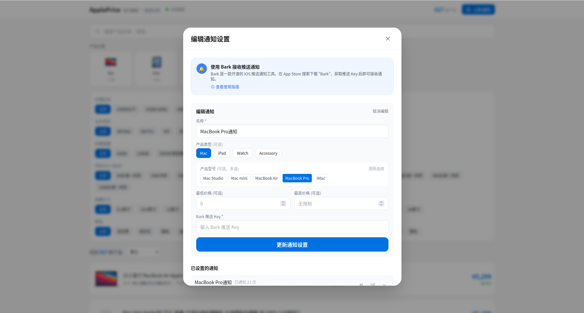
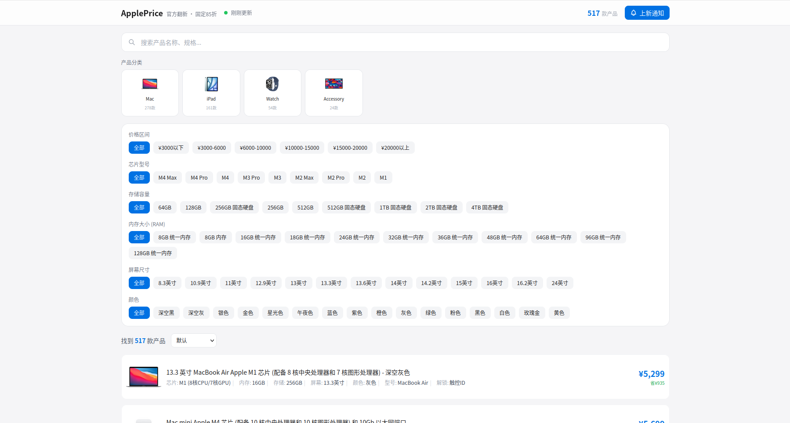

# ApplePrice - 苹果官方翻新产品价格监听工具

<p align="center">
  
  
</p>

<p align="center">
  <a href="#功能特性">功能特性</a> •
  <a href="#快速开始">快速开始</a> •
  <a href="#docker-部署">Docker 部署</a> •
  <a href="#bark-推送通知配置">Bark 配置</a>
</p>

---

实时监听苹果中国大陆和香港地区官方翻新产品，智能分析性价比，第一时间推送新品上架通知。

## 功能特性

- **自动爬取** - 每5分钟自动同步 Apple CN/HK 翻新产品价格
- **智能推荐** - AI 分析产品配置，计算性价比评分
- **价格追踪** - 记录价格历史，K线图展示价格走势
- **上新通知** - 新品上架立即推送，支持按品类/价格/型号筛选
- **价格提醒** - 降价、达到目标价自动通知
- **多用户支持** - 每个用户独立配置，数据隔离保护隐私
- **Bark 推送** - iOS 原生推送通知，秒级触达

## 技术栈

| 前端 | 后端 | 存储 | 通知 |
|:---:|:---:|:---:|:---:|
| React + Vite | Go + Gin | SQLite | Bark API |
| TailwindCSS | 定时任务 | 持久化 | iOS Push |

## 快速开始

### 后端

```bash
cd backend
go mod download
go run cmd/server/main.go
```

### 前端

```bash
cd frontend
npm install
npm run dev
```

访问 http://localhost:5173 即可使用。

## Docker 部署

```bash
# 一键启动
docker-compose up -d

# 查看日志
docker-compose logs -f
```

## Bark 推送通知配置

本项目使用 [Bark](https://github.com/Finb/Bark) 作为 iOS 推送通知服务。

### 快速配置

1. **下载 Bark App** - App Store 搜索 "Bark"
2. **获取推送 Key** - 打开 App，首页显示的字符串
3. **配置订阅** - 网页端输入 Bark Key，创建订阅规则

### 支持的通知类型

| 通知类型 | 说明 |
|:-------|:-----|
| **新品上架** | 符合筛选条件的新产品上架时推送 |
| **价格变动** | 订阅的产品价格变化时推送 |
| **目标价提醒** | 产品价格降至目标价以下时推送 |

### 隐私保护

- Bark Key 仅存储在本地浏览器（localStorage）
- 不同用户的数据完全隔离
- API 返回时 Bark Key 脱敏显示

## API 接口

### 产品

```
GET  /api/products              # 产品列表（支持分类、排序、筛选）
GET  /api/products/:id          # 产品详情
GET  /api/products/:id/history  # 价格历史
GET  /api/categories            # 分类列表
GET  /api/filter-options        # 筛选选项（芯片/内存/存储等）
GET  /api/stats                 # 统计信息
```

### 订阅

```
POST   /api/new-arrival-subscriptions              # 创建新品订阅
GET    /api/new-arrival-subscriptions?bark_key=xxx # 获取我的订阅
PUT    /api/new-arrival-subscriptions/:id          # 更新订阅
DELETE /api/new-arrival-subscriptions/:id          # 删除订阅
PATCH  /api/new-arrival-subscriptions/:id/pause    # 暂停订阅
PATCH  /api/new-arrival-subscriptions/:id/resume   # 恢复订阅
```

### 通知历史

```
GET /api/notification-history?bark_key=xxx  # 获取通知历史
```

## 目录结构

```
apple-price/
├── backend/
│   ├── cmd/server/          # 主程序
│   └── internal/
│       ├── api/             # HTTP 接口
│       ├── scraper/         # 产品爬虫
│       ├── notify/          # 通知服务
│       ├── store/           # 数据存储
│       └── config/          # 配置管理
├── frontend/
│   └── src/
│       ├── components/      # React 组件
│       └── utils/           # 工具函数
├── img0.png                 # 截图：产品列表
├── img1.png                 # 截图：通知设置
└── docker-compose.yml
```

## 致谢

- [Bark](https://github.com/Finb/Bark) - 优秀的 iOS 自定义推送工具

## 许可证

[MIT](LICENSE)
